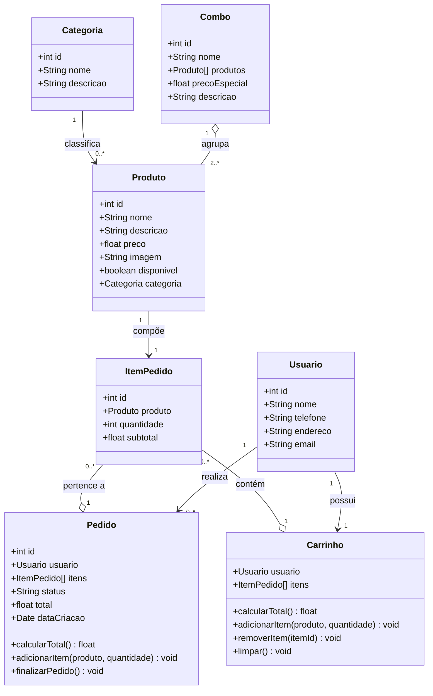

# Modelagem UML — Sistema Real (Tropykaly Pizzas e Lanches)

---

## Parte 6 – Modelagem do Sistema

### Identificação de Entidades

Com base na análise do comportamento externo do sistema, as seguintes entidades foram identificadas por inferência:

| Entidade       | Justificativa                                                         |
|----------------|-----------------------------------------------------------------------|
| `Usuario`      | Clientes que acessam o sistema e realizam pedidos                    |
| `Categoria`    | Agrupa produtos (Pizzas, Lanches, Bebidas, Acompanhamentos)          |
| `Produto`      | Item do cardápio com nome, preço, descrição e imagem                 |
| `ItemPedido`   | Representa um produto dentro de um pedido com quantidade e subtotal  |
| `Pedido`       | Conjunto de itens solicitados por um usuário                         |
| `Carrinho`     | Estado temporário antes da finalização do pedido                     |
| `Combo`        | Agrupamento promocional de produtos com preço especial               |

---

### Definição de Classes e Atributos

#### Usuario
- id: int
- nome: String
- telefone: String
- endereco: String
- email: String

#### Categoria
- id: int
- nome: String
- descricao: String

#### Produto
- id: int
- nome: String
- descricao: String
- preco: float
- imagem: String
- disponivel: boolean
- categoria: Categoria

#### ItemPedido
- id: int
- produto: Produto
- quantidade: int
- subtotal: float

#### Pedido
- id: int
- usuario: Usuario
- itens: ItemPedido[]
- status: String
- total: float
- dataCriacao: Date

#### Carrinho
- usuario: Usuario
- itens: ItemPedido[]
- calcularTotal(): float
- adicionarItem(produto, quantidade): void
- removerItem(itemId): void
- limpar(): void

#### Combo
- id: int
- nome: String
- produtos: Produto[]
- precoEspecial: float
- descricao: String

---

### Diagrama de Classes (UML)

---

### Justificativa das Escolhas

- **Carrinho** foi modelado separado de **Pedido** porque representam estados distintos: o carrinho é temporário (sessão do usuário), enquanto o pedido é persistido no banco de dados após confirmação
- **Categoria** foi modelada como entidade independente para permitir que o cardápio seja reorganizado sem alterar os produtos individualmente
- **Combo** foi incluído porque o sistema apresenta seção dedicada a combos promocionais, sugerindo que são entidades gerenciáveis pelo administrador
- A multiplicidade `1 para 0..*` entre `Usuario` e `Pedido` reflete que um usuário pode ter múltiplos pedidos ao longo do tempo
- A multiplicidade `1 para 1` entre `Usuario` e `Carrinho` reflete que cada sessão possui apenas um carrinho ativo

---

### Parte 10 – Reflexão Crítica

**1. É possível modelar um sistema sem ver o código?**

Sim. A engenharia reversa baseada no comportamento permite identificar as principais entidades, seus relacionamentos e o fluxo de dados a partir da interface e das funcionalidades visíveis. A modelagem resultante pode não ser idêntica à implementação real, mas captura a essência do domínio do problema — que é o mais importante.

**2. Qual a importância da modelagem?**

A modelagem UML serve como linguagem comum entre desenvolvedores, analistas e stakeholders. Ela facilita a comunicação, antecipa problemas de design antes da implementação, documenta o sistema para manutenção futura e guia refatorações. Sem modelagem, sistemas crescem de forma caótica, tornando-se difíceis de manter.

**3. Diferença entre sistema real e didático?**

O sistema didático foi propositalmente simplificado para expor problemas de design de forma clara e controlada. O sistema real opera em produção com usuários reais, dados persistidos, integração com serviços externos e pressões de prazo — o que frequentemente resulta em decisões técnicas pragmáticas que sacrificam a elegância arquitetural em favor da entrega. Modelar os dois evidencia que os mesmos princípios (coesão, acoplamento, separação de responsabilidades) se aplicam em qualquer escala.
